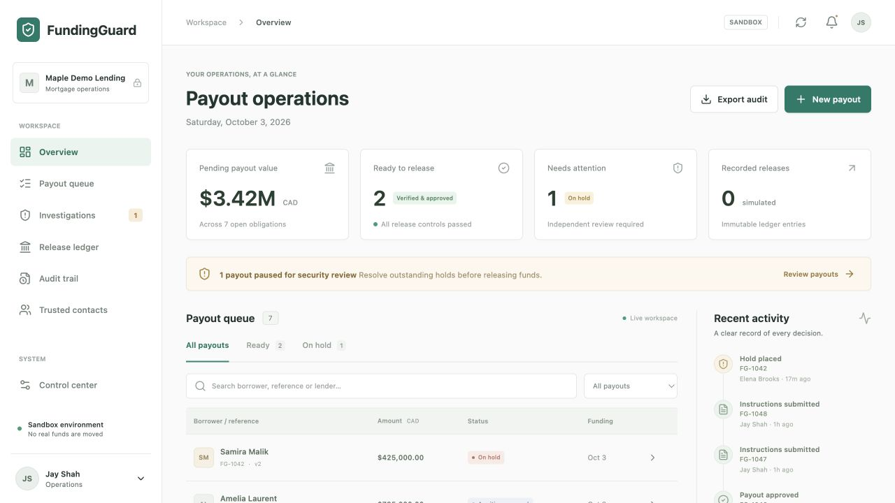
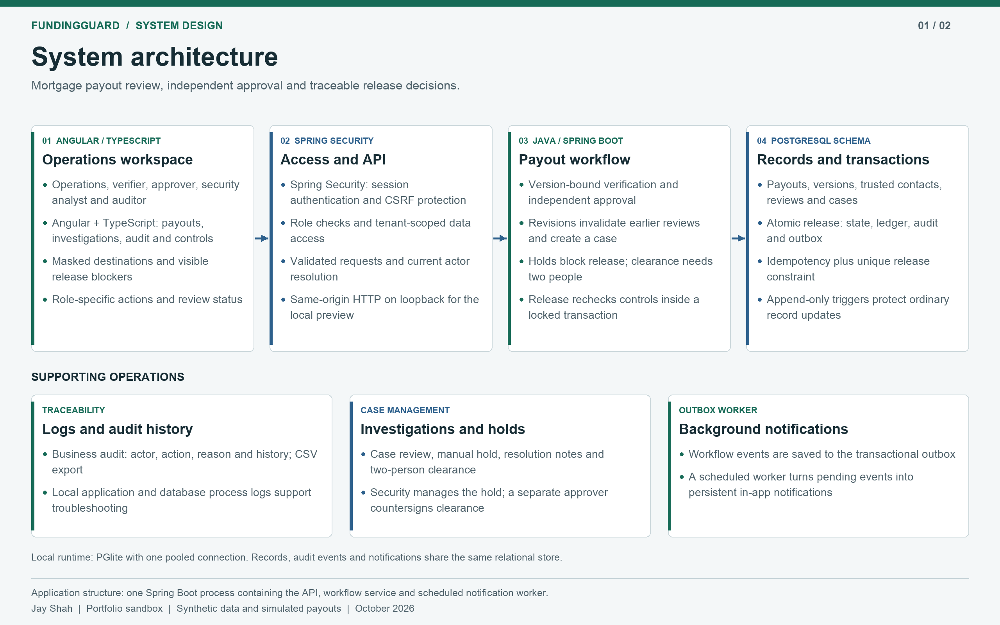
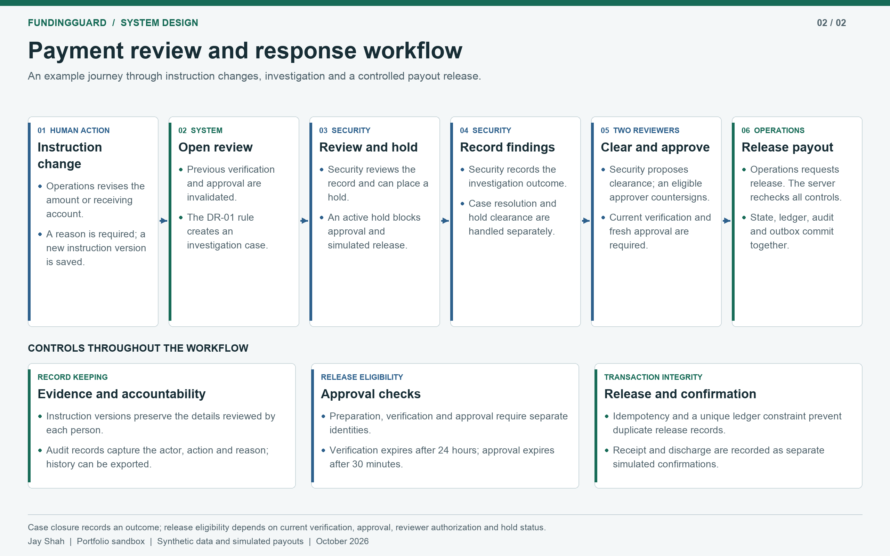
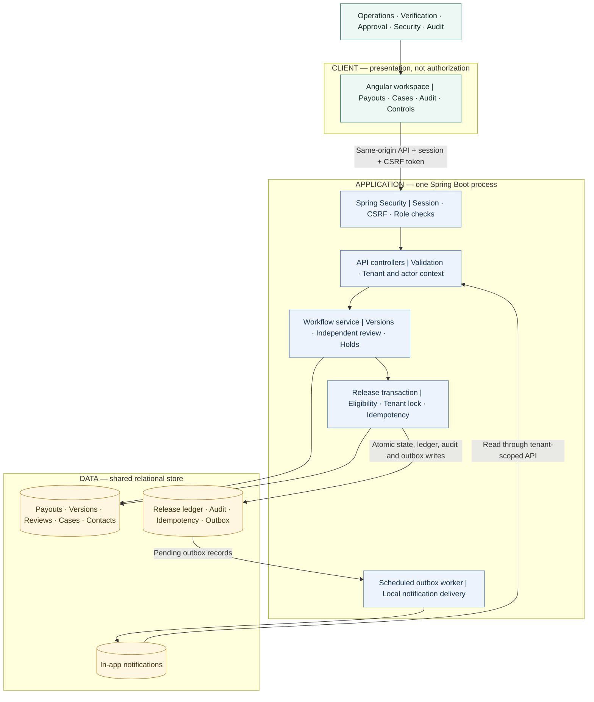

# FundingGuard

### Payment instructions change. Approval should not follow blindly.

FundingGuard is a mortgage payout-control prototype that makes changed instructions visible, requires independent review, and prevents a simulated release when its controls are not satisfied.

**Angular 20 · TypeScript · Java 21 · Spring Boot · PostgreSQL schema · PGlite local preview**

[Architecture](#architecture) · [Quick start](#quick-start) · [Walkthrough](#walkthrough) · [Testing](#testing) · [Boundaries](#boundaries)

> **Portfolio sandbox, not a banking service.** All records are synthetic. No real money moves, no recipient ownership is verified, and no fraud determination is made. The project does not claim regulatory compliance or production readiness.



## The problem

A mortgage operations team is preparing a CAD 425,000 payout. Shortly before funding, replacement instructions change the receiving account. The original approval may have been valid, but it was an approval of different instructions.

FundingGuard asks a narrower, more defensible question than "Is this fraud?": **Are the current instructions independently verified, currently approved, and eligible for release?**

| Operational risk | Implemented response |
|---|---|
| Old approval reused after an account change | New instruction version; previous verification and approval invalidated |
| One person prepares and authorizes a payout | Distinct preparation, verification and approval identities |
| Payout released during an investigation hold | Server-enforced hold, not just a disabled UI button |
| Retry creates a second release | Actor-bound idempotency and a unique ledger constraint |
| Review history is difficult to reconstruct | Actors, reasons and workflow events recorded in an append-only audit trail |

## Architecture





[executive architecture](docs/assets/fundingguard-executive-architecture.jpg) and [response workflow](docs/assets/fundingguard-security-response-map.jpg).

**Design:** a modular monolith with one authoritative transaction boundary. These are implemented components, not a proposed cloud estate or separately deployed microservices.



**Runtime boundary:** the local preview runs on loopback with a single-connection PGlite PostgreSQL-compatible runtime. Native PostgreSQL is the intended multi-connection test target. Data boxes are logical table groups in one database. No external bank, identity provider, SIEM or messaging service is integrated.

### Decisions that matter

- **The server decides.** Release rechecks current instructions, reviewer identity, evidence age, contact versions and holds.
- **Consistency before throughput.** A tenant-row lock serializes writes within that tenant. This is not a high-throughput design claim.
- **Auditability, not cryptographic immutability.** Triggers reject ordinary changes to protected records; a privileged database administrator can still change the database.
- **Closing a case does not authorize payment.** Hold clearance requires two people and a fresh approval remains necessary afterward.
- **Notifications stay local.** The worker persists in-app messages; it does not send email or trigger an external response platform.

See [architecture and trade-offs](docs/ARCHITECTURE.md) for state transitions, threat boundaries and design rationale.

## Workflow

1. **Prepare:** Operations records synthetic payment instructions.
2. **Verify:** A different reviewer records simulated verification against the established contact.
3. **Approve:** A third identity approves the current instruction and contact versions.
4. **Release:** The backend revalidates all controls before committing one simulated release.
5. **Investigate:** Revised instructions invalidate earlier checks and create a review case. Security may apply a hold.
6. **Recover:** Security proposes hold clearance, an approver countersigns, and current verification and approval requirements must still be satisfied.

Verification expires after **24 hours**; approval after **30 minutes**. Receipt and discharge are separate simulated confirmations after release. Closing an investigation does not clear a hold.

## Quick start

### Prerequisites

- Node.js **22.12+ within the 22.x line**, npm, Java **21**, and Maven **3.9+**
- Internet access for initial dependency installation

No cloud account, paid API, AI subscription or separately installed database is required for the local preview.

From the repository root:

```sh
npm ci
npm --prefix frontend ci
npm --prefix frontend run build
mvn -f backend/pom.xml package -DskipTests
npm run preview
```

Packaging skips integration tests because they require a running test database. Run the separate test workflow below.

Open **http://127.0.0.1:8088**. Select **Jay Shah / Operations** and use the public local-demo password `FundingGuard-Local-2026!`.

To set a different seed password on a fresh database:

```sh
DEMO_PASSWORD='your-local-demo-password' npm run preview
```

The preview reads exported environment variables; it does not automatically load `.env` files. `.env.example` documents the settings. Changing the seed password does not modify existing accounts.

### Busy ports

```sh
APP_PORT=8092 PREVIEW_DB_PORT=55444 npm run preview
```

Open **http://127.0.0.1:8092**. Both ports must be free. The launcher does not replace another running service.

### Stop and restart

```sh
node scripts/stop-preview.mjs
# For the alternate application port:
APP_PORT=8092 node scripts/stop-preview.mjs
```

Data, process identifiers and application/database logs stay in the ignored `.runtime/` directory. Stopping preserves data. Rebuild after source changes, then restart. A running preview uses a snapshot of the packaged JAR.

## Walkthrough

Open **Samira Malik / FG-1042**. Compare account endings **2041** and **9988** in version history, inspect the investigation and observe the blocked release. All identities, contacts, amounts and addresses are synthetic.

Create a new payout and switch identities through the account menu to verify, approve and release it. Inspect the ledger and audit trail afterward. Seeded approvals expire; they are not permanently valid.

| Demo identity | Responsibility |
|---|---|
| Jay Shah — Operations | Prepare, revise and request simulated release |
| Noah Singh — Verification officer | Record independent verification |
| Maya Chen — Payment approver | Approve instructions; countersign hold clearance |
| Elena Brooks — Security analyst | Place holds, propose clearance and resolve cases |
| Owen Reed — Auditor | Inspect records and export audit history |

Identities share a demo password. They illustrate permissions, not real-world identity assurance or separation of duties.

## Testing

### Integration suite

In one terminal, from the root:

```sh
npm run db:test
```

In a second terminal:

```sh
mvn -f backend/pom.xml test
```

Use a disposable test database. The default test instance uses port **55439** and `.runtime/test-db`. Stop it with Ctrl+C.

### Browser suite

With a seeded preview running:

```sh
cd frontend
npx playwright install chromium
npx playwright test
```

For another port, use `BASE_URL=http://127.0.0.1:8092 npx playwright test`. Supply `DEMO_PASSWORD` if changed. Tests create synthetic records; do not use valuable data.

## Boundaries

**Implemented:** role and tenant checks, CSRF protection, masked account responses, integer-cent amounts, versioning, expiring reviews, holds, case resolution, audit export, idempotent simulated release and local notifications.

**Not implemented:** real payments or bank verification; actual callbacks; external SIEM/SOAR; threat hunting or fraud classification; evidence uploads; SSO/MFA; production account management; distributed delivery; operational monitoring; load-tested capacity or compliance certification.

This is an **AI-assisted portfolio project** demonstrating inspectable control logic, not a replacement for a lender's payment, fraud or security platform. Do not expose demo credentials or the preview database on the public internet.

## Repository guide

| Path | Purpose |
|---|---|
| `frontend/src/` | Angular workspace and user workflows |
| `backend/src/main/java/io/fundingguard/` | API, security, transactions and outbox worker |
| `backend/src/main/resources/db/migration/` | Schema, constraints and append-only triggers |
| `backend/src/test/` | Workflow and HTTP integration tests |
| `frontend/tests/` | Browser workflows and responsive checks |
| `scripts/` | Local preview and database helpers |
| `docs/` | Architecture, verification notes and screenshots |

